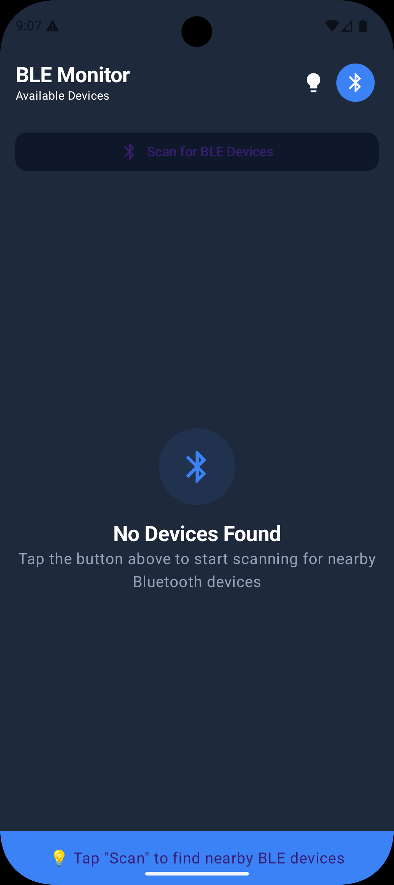
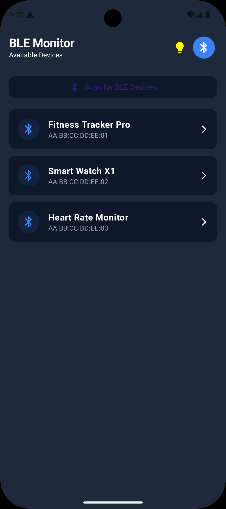
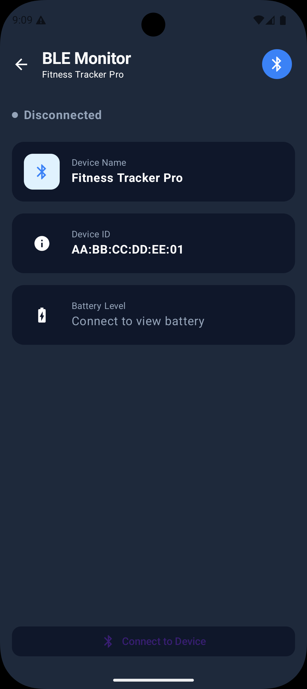
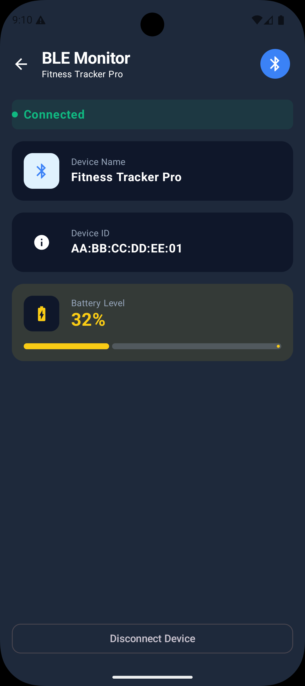

# KMP BLE Scanner

A modern, cross-platform Bluetooth Low Energy (BLE) scanner application built with Kotlin Multiplatform (KMP) and Jetpack Compose. This app demonstrates how to handle BLE operations like scanning, connecting, and reading data on both Android and iOS from a shared codebase.

## ✨ Features

- **Cross-Platform:** Single shared codebase for Android and iOS.
- **BLE Scanning:** Scans for nearby BLE devices and displays them in a list sorted by signal strength.
- **Device Details:** View detailed information about a selected device.
- **Secure Connection:** Handles secure bonding (pairing) with devices that require it.
- **Battery Level Reader:** Connects to devices and reads the standard Battery Level characteristic.
- **Modern UI:** A clean, multi-screen user interface built entirely with Compose Multiplatform.
- **Demo Mode:** Includes a toggleable demo mode to showcase UI and app logic without real hardware, using hardcoded data.

## 📸 Screenshots

The application features a clean, intuitive UI for scanning, connecting, and monitoring devices.

|              Device List (Empty)               |             Device List (Found)                |              Device Details (Disconnected)               |               Device Details (Connected)               |
|:----------------------------------------------:|:----------------------------------------------:|:--------------------------------------------------------:|:------------------------------------------------------:|
|  |  |  |    |

## 🛠️ Built With

- [Kotlin Multiplatform](https://kotlinlang.org/docs/multiplatform.html) - For sharing code between Android and iOS.
- [Jetpack Compose](https://developer.android.com/jetpack/compose) - For building the shared UI.
- [Coroutines & StateFlow](https://kotlinlang.org/docs/coroutines-guide.html) - For managing asynchronous operations and UI state.
- **Native BLE Frameworks**:
    - `CoreBluetooth` on iOS.
    - `android.bluetooth` on Android.

## 🚀 Getting Started

This is a Kotlin Multiplatform project targeting Android and iOS.

*   `/composeApp` is for code that is shared across your Compose Multiplatform applications.
*   `/iosApp` contains the iOS application entry point.

### Build and Run Android Application

To build and run the development version of the Android app, use the "composeApp" run configuration from the run widget in your IDE’s toolbar or build it directly from the terminal:

- on macOS/Linux
  ```shell
  ./gradlew :composeApp:assembleDebug
  ```
- on Windows
```shell
  .\gradlew.bat :composeApp:assembleDebug
  ```
Build and Run iOS Application
To build and run the development version of the iOS app, use the "iosApp" run configuration from the run widget in your IDE’s toolbar or open the /iosApp directory in Xcode and run it from there.